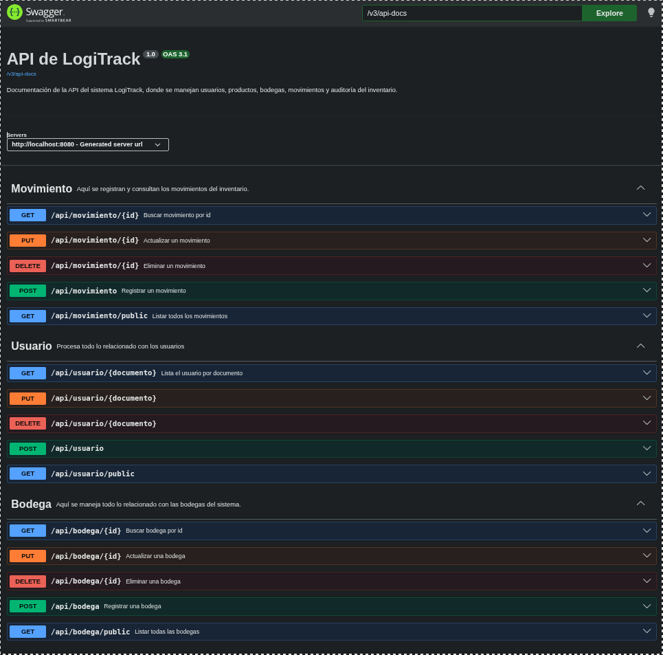
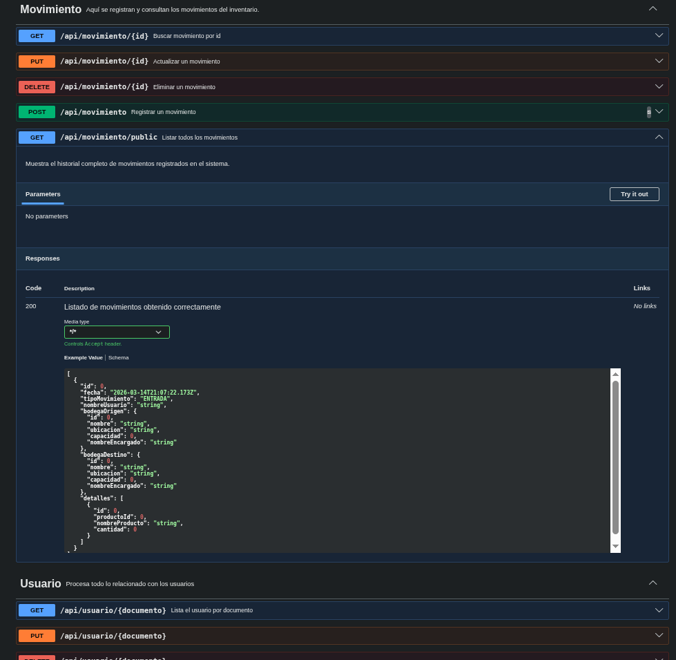
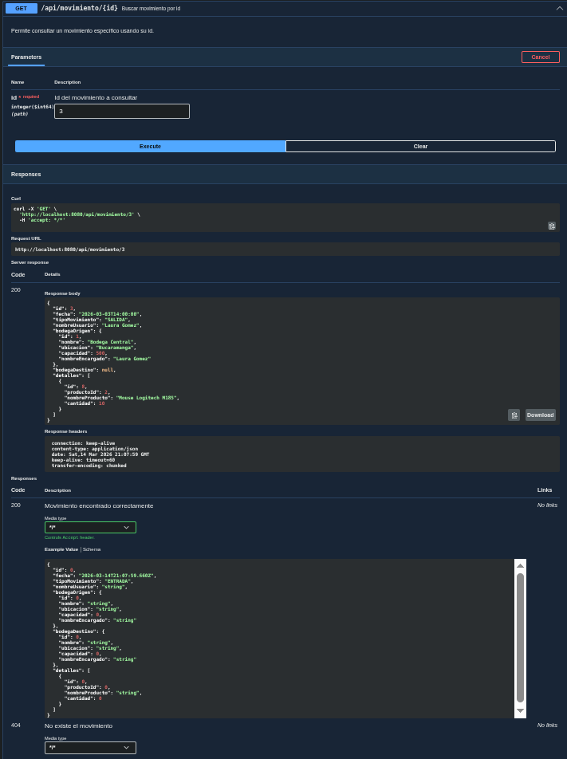
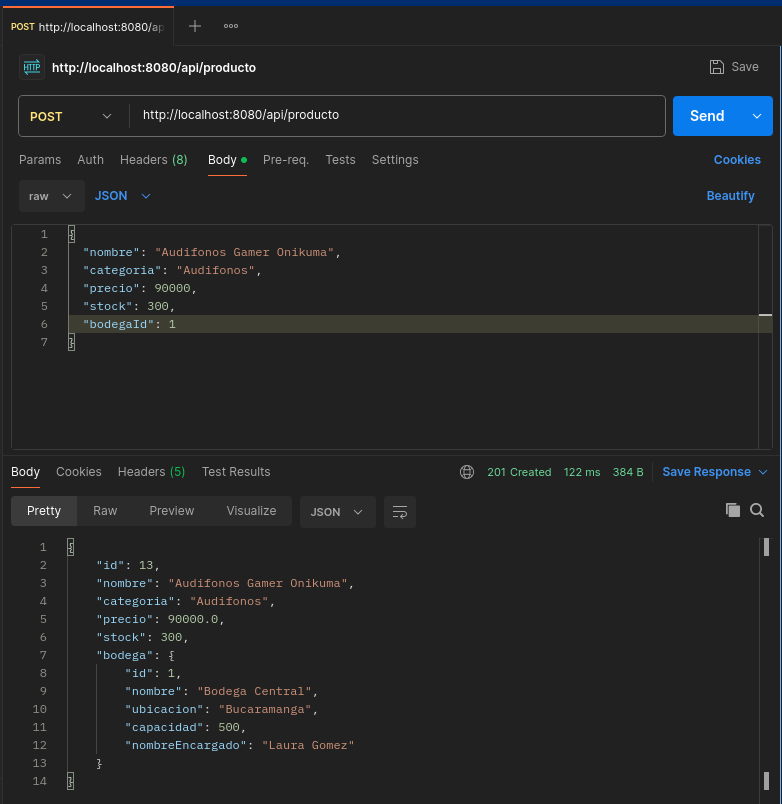
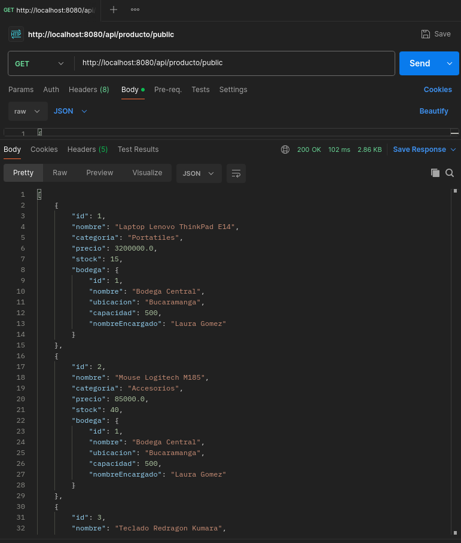
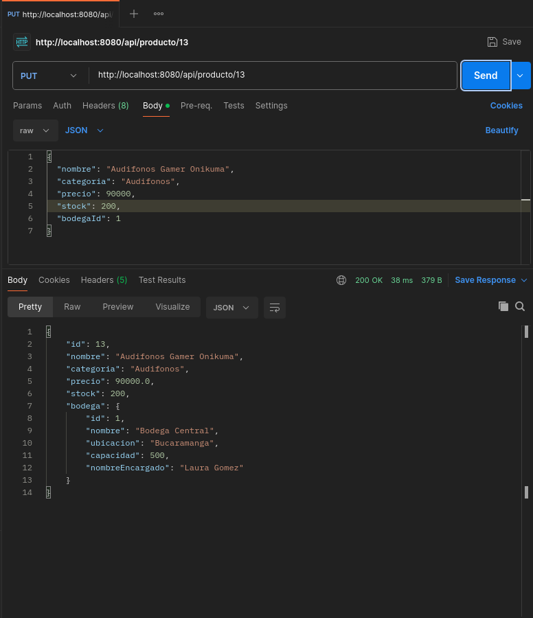

<h1 align=center>API REST LOGITRACK</h1> <h6 align=center>Proyecto Spring Boot: Sistema de Gestión y Auditoría de Bodegas</h6> 
     

---

## Tabla de Contenido

<h6 align=center> 1. Introducción </h6> <h6 align=center> 2. Caso de Estudio </h6> <h6 align=center> 3. Descripción del proyecto </h6> <h6 align=center> 4. Requerimientos funcionales del sistema </h6> <h6 align=center> 5. Estructura del proyecto </h6> <h6 align=center> 6. Arquitectura general del backend </h6> <h6 align=center> 7. Modelo de datos del sistema </h6> <h6 align=center> 8. Configuración e instalación </h6> <h6 align=center> 9. Documentación de endpoints </h6> <h6 align=center> 10. Validaciones y comportamiento general </h6> <h6 align=center> 11. Swagger y pruebas de la API </h6> <h6 align=center> 12. Observaciones sobre el estado actual del proyecto </h6> <h6 align=center> 13. Conclusión </h6>

---

## 1. Introducción

LogiTrack es un sistema backend desarrollado con Spring Boot, orientado a la administración de bodegas, productos, movimientos de inventario y registros de auditoría dentro de una organización con múltiples puntos de almacenamiento. La finalidad principal del proyecto es centralizar la información operativa que anteriormente se llevaba de forma manual, mejorando la organización de los datos, la trazabilidad de los cambios y la consulta de la información desde una API REST.

A través de esta implementación, se busca ofrecer una estructura clara por capas, compuesta por controladores, servicios, repositorios, entidades, DTOs y mappers, permitiendo separar responsabilidades y facilitar tanto el mantenimiento como la escalabilidad del sistema. Del mismo modo, el proyecto incorpora documentación con Swagger/OpenAPI para exponer de manera más clara los endpoints disponibles.

A continuación se documenta el funcionamiento general del proyecto LogiTrack, describiendo la estructura del backend, las entidades principales, la configuración necesaria para su ejecución local, así como los endpoints implementados actualmente para la gestión de usuarios, bodegas, productos, movimientos y auditorías.

---

## 2. Caso de Estudio

La empresa LogiTrack S.A. administra varias bodegas distribuidas en distintas ciudades, encargadas de almacenar productos y registrar los diferentes movimientos asociados al inventario. Hasta antes de este sistema, el control se realizaba manualmente en hojas de cálculo, lo que generaba poca trazabilidad, duplicidad de información y dificultades para auditar los cambios realizados por cada usuario.

Frente a esta necesidad, se plantea el desarrollo de una API REST centralizada que permita gestionar de manera estructurada las bodegas, los productos y los movimientos de inventario, junto con el registro de auditorías sobre los cambios efectuados en el sistema.

Desde una perspectiva funcional, el backend debe facilitar operaciones CRUD, filtros de consulta y documentación clara de cada endpoint. Así mismo, el proyecto está pensado como una base sobre la cual puede fortalecerse posteriormente la parte de seguridad, control de accesos y reportes más avanzados.

Problema: control manual del inventario, poca trazabilidad y ausencia de auditoría centralizada.

Solución: backend en Spring Boot con acceso mediante endpoints REST, persistencia en MySQL y documentación con Swagger/OpenAPI.

Alcance actual: usuarios, bodegas, productos, movimientos de inventario y consultas de auditoría.

---

## 3. Descripción del proyecto

Este proyecto tiene como objetivo el desarrollo de una API REST para la gestión de bodegas e inventario dentro del sistema LogiTrack. La aplicación fue construida en Java 17 con Spring Boot, utilizando Spring Web, Spring Data JPA, Bean Validation, MySQL y Springdoc OpenAPI para la documentación.

La solución se apoya en una arquitectura por capas, en la cual las entidades representan la estructura de datos persistida en la base de datos, los DTOs controlan la entrada y salida de información, los mappers realizan la conversión entre entidades y DTOs, los repositorios se encargan del acceso a datos y los servicios procesan la lógica principal de la aplicación.

De forma general, el sistema permite registrar usuarios con roles, asignar encargados a bodegas, asociar productos a una bodega específica, crear movimientos de inventario con detalle de productos y consultar los registros de auditoría almacenados en la base de datos.

---

## 4. Requerimientos funcionales del sistema

Registrar, consultar, actualizar y eliminar usuarios.

Registrar, consultar, actualizar y eliminar bodegas.

Registrar, consultar, actualizar y eliminar productos.

Registrar, consultar, actualizar y eliminar movimientos de inventario.

Consultar auditorías por id, por nombre de usuario y por tipo de operación.

Listar productos con stock bajo (menor a 10 unidades).

Conectar el sistema a una base de datos MySQL.

Documentar los endpoints mediante Swagger/OpenAPI.

Validar datos de entrada usando anotaciones como @NotBlank, @NotNull, @Positive, @Min, @Size y @NotEmpty.

---

## 5. Evidencias de funcionamiento

Con el fin de respaldar el correcto funcionamiento del sistema LogiTrack, en este apartado se anexan evidencias visuales obtenidas durante las pruebas realizadas sobre la API. Estas evidencias permiten demostrar que los endpoints implementados responden correctamente a las solicitudes enviadas desde herramientas de prueba y documentación, reflejando el comportamiento esperado del sistema.

Las capturas que se incluirán a continuación corresponden a pruebas realizadas sobre los módulos principales del proyecto, permitiendo verificar operaciones como registro, consulta, actualización y eliminación de información, así como la visualización de la documentación interactiva generada mediante Swagger/OpenAPI.

<h3 align=center>5.1 Evidencias desde Swagger UI</h3>

En esta subsección se ubicarán las capturas relacionadas con la documentación interactiva de la API en Swagger UI, donde se puede observar la estructura de los endpoints disponibles, los métodos HTTP implementados y las respuestas generadas por el sistema al ejecutar las peticiones.

### Vista general de Swagger UI

### Endpoint de listar de movimiento

###  Respuesta obtenida desde Swagger

---

<h3 align=center>5.2 Evidencias desde Postman</h3>

En esta subsección se ubicarán las capturas realizadas desde Postman, herramienta utilizada para comprobar de manera más detallada el comportamiento de la API frente a distintas solicitudes HTTP. A través de estas evidencias se puede observar el envío de datos, los parámetros utilizados y las respuestas devueltas por el backend en formato JSON.

###  Prueba de registro mediante POST

    
###  Prueba de consulta mediante GET

###  Prueba de actualización 

---

<h3 align=center>5.3 Observación general</h3>

Las siguientes evidencias visuales se incluyen con el propósito de dejar constancia de que la API desarrollada en el proyecto LogiTrack fue ejecutada y probada correctamente, tanto desde la documentación generada en Swagger como desde clientes de pruebas como Postman.
